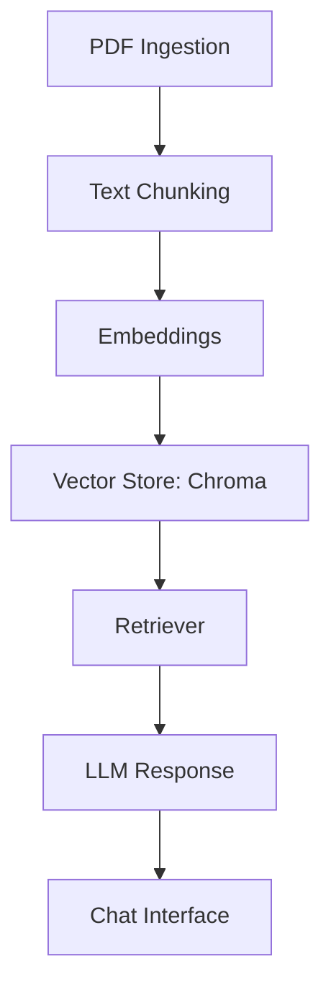
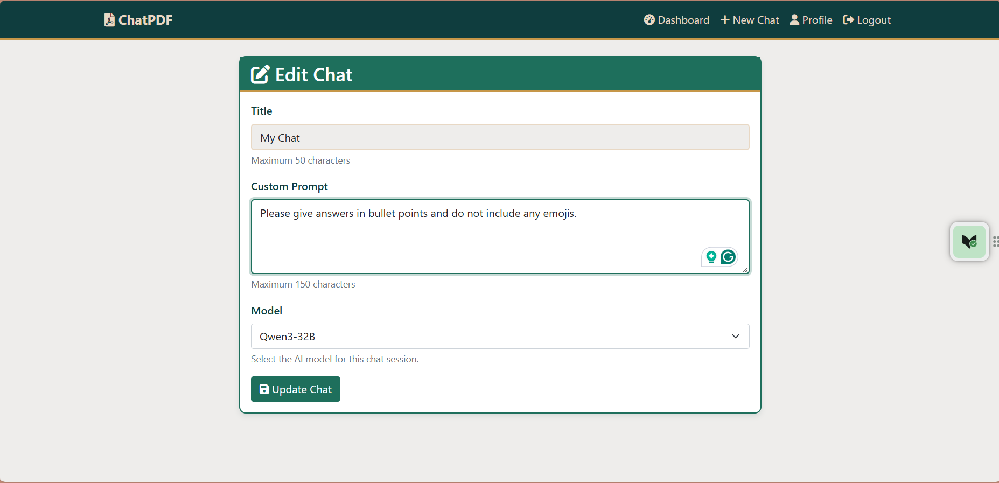
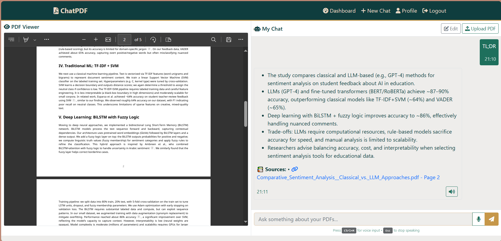

# ChatPDF: AI-powered chat interface for querying PDF documents using LangChain and RAG architecture

---

| Build Status | Test Coverage | License | Version |
|--------------|--------------|---------|---------|
|  |  |  |  |

---

## Table of Contents
- [Project Overview](#project-overview)
- [Features](#features)
- [Architecture](#architecture)
- [Technology Stack](#technology-stack)
- [Installation & Setup](#installation--setup)
- [Environment Variables](#environment-variables)
- [Quick Start Guide](#quick-start-guide)
- [Usage](#usage)
- [API Reference](#api-reference)
- [Configuration Options](#configuration-options)
- [Example Workflows](#example-workflows)
- [Technical Details](#technical-details)
- [Performance & Security](#performance--security)
- [Contributing](#contributing)
- [Changelog](#changelog)
- [License](#license)
- [Troubleshooting](#troubleshooting)
- [FAQ](#faq)
- [Screenshots](#screenshots)

---

## Project Overview
ChatPDF is an AI-powered chat interface for querying PDF documents. It uses LangChain and Retrieval-Augmented Generation (RAG) to provide context-aware answers, semantic search, conversational memory, and citation tracking.

---

## Features
- **PDF Upload & Management**
- **Semantic Search & RAG**
- **Conversational Memory**
- **Citation Tracking**
- **Voice Interaction (STT/TTS)**
- **Model Selection (Groq, Gemini, etc.)**
- **Responsive UI**
- **User Authentication**
- **Source Attribution**
- **Streaming Responses**
- **Error Handling & Notifications**

---

## Architecture


---

## Technology Stack
| Component         | Technology         |
|-------------------|-------------------|
| Framework         | Flask             |
| LLM Orchestration | LangChain (v0.x)  |
| Vector DB         | Chroma            |
| Embeddings        | all-MiniLM-L6-v2  |
| LLM Provider      | Groq, Gemini      |
| Frontend          | CSS, Js, HTMX     |
| Database          | SQLite            |
| Voice             | Web Speech API    |

---

## Installation & Setup
### Prerequisites
- Python 3.8+
- Git
- (Optional) Virtual environment tool
- API keys for LLMs and vector DBs

### Step-by-step Installation
```bash
git clone https://github.com/abdullaharifx/PL-Work.git
cd PL-Work/LangChain/ChatPDF
python -m venv venv
venv\Scripts\activate  # Windows
pip install -r requirements.txt
```

---

## Environment Variables
Create a `.env` file:
```env
FLASK_ENV=development
SECRET_KEY=your_secret_key
GROQ_API_KEY=your_groq_api_key
GEMINI_API_KEY=your_gemini_api_key
VECTOR_DB_URL=your_vector_db_url
```
| Variable         | Description                |
|------------------|---------------------------|
| FLASK_ENV        | Flask environment         |
| SECRET_KEY       | Session security          |
| GROQ_API_KEY     | Groq LLM API key          |
| GEMINI_API_KEY   | Gemini LLM API key        |
| VECTOR_DB_URL    | Vector DB connection      |

---

## Quick Start Guide
```bash
python run.py
```
Visit [http://localhost:5000](http://localhost:5000)

---

## Usage
- Register and log in
- Upload PDFs
- Select LLM model
- Ask questions
- View citations
- Use voice features

---

## API Reference
| Endpoint                | Method | Description                  |
|-------------------------|--------|------------------------------|
| `/api/upload`           | POST   | Upload PDF                   |
| `/api/chat`             | POST   | Send chat message            |
| `/api/search`           | GET    | Semantic search              |

Example request:
```json
POST /api/chat
{
  "chat_id": 123,
  "message": "Summarize this PDF"
}
```

---

## Configuration Options
| Option           | Default | Description                  |
|------------------|---------|------------------------------|
| chunk_size       | 512     | Text chunk size              |
| chunk_overlap    | 64      | Overlap between chunks       |
| similarity_thr   | 0.8     | Retrieval similarity cutoff  |
| model_selection  | qwen3-32b | LLM model per chat         |

---

## Example Workflows
1. Upload PDF → Ask question → Get answer with citations
2. Use voice input → Receive spoken response
3. Switch LLM model for a chat session

---

## Technical Details
- **Data Flow:** PDF → Chunking → Embedding → Vector DB → Retrieval → LLM → Response
- **Performance:** Recommended: 4GB RAM+, SSD, API rate limits
- **Security:** API keys in `.env`, HTTPS for deployment, user authentication

---

## Contributing
- Fork, branch, PR
- Follow PEP8
- Add tests
- See [CONTRIBUTING.md](CONTRIBUTING.md)

---

## Changelog
See [CHANGELOG.md](CHANGELOG.md) for version history.

---

## License
MIT License. See [LICENSE.md](LICENSE.md).

---

## Troubleshooting
| Issue                | Solution                       |
|----------------------|-------------------------------|
| API key error        | Check `.env` file              |
| Vector DB not found  | Verify VECTOR_DB_URL           |
| LLM timeout          | Check provider status          |

---

## FAQ
**Q:** Can I use other LLMs?  
**A:** Yes, add API keys and update config.

**Q:** Is my data private?  
**A:** Yes, PDFs are stored locally and not shared.


---

## Screenshots




---
