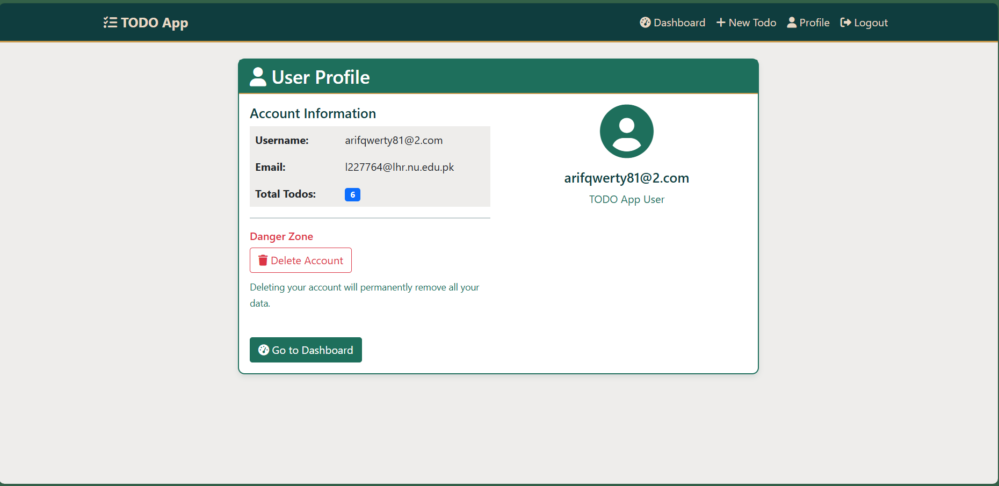

# Flask Todo App

A simple and intuitive Todo application built with Flask. This project demonstrates CRUD operations, template rendering, and static file management in Flask.

## Features

- Add, edit, and delete tasks
- Mark tasks as complete/incomplete
- Responsive UI using Bootstrap
- Persistent storage with SQLite

## Project Structure

```
flask-todo-app/
│
├── app.py                # Main Flask application
├── requirements.txt 
├── view_schema.py      # to see database schema
├── models.py             # Database models commented out
├── templates/            # HTML templates (Jinja2)
│   ├── base.html
│   ├── create_todo.html
│   ├── dashboard.html
│   ├── delete_todo.html
│   ├── edit_todo.html
│   ├── index.html
|   ├── login.html
│   ├── profile.html
|   └── register.html
├── static
│   ├── img   # Static images
│   │   └── main.png
|   ├   └── todo.png
|   |   └── user.png   
│   └── css   # Static files (CSS, JS, images)
│       └── custom.css
│
└── README.md
```

## Screenshots

### Main


### TODO List


### User Profile



## Getting Started

### Prerequisites

- Python 3.x installed on your system

### Installation

1. **Clone the repository:**
    ```bash
    git clone https://github.com/AbdullAharifx/flask-todo-app.git
    cd flask-todo-app
    ```

2. **Create a virtual environment (optional but recommended):**
    ```bash
    python -m venv venv
    source venv/bin/activate  # On Windows: venv\Scripts\activate
    ```

3. **Install dependencies:**
    ```bash
    pip install -r requirements.txt
    ```

### Running the App

```bash
python app.py
```

Visit [http://127.0.0.1:5000](http://127.0.0.1:5000) in your browser.

## Folder Descriptions

- **app.py**: Main application file containing routes and logic.
- **templates/**: Contains HTML templates rendered by Flask.
- **static/**: Holds static assets like CSS and images.
- **requirements.txt**: Lists all Python dependencies for easy setup.

## Contributing

Pull requests are welcome! For major changes, please open an issue first to discuss what you would like to change.

## License

This project is licensed under the MIT License.
