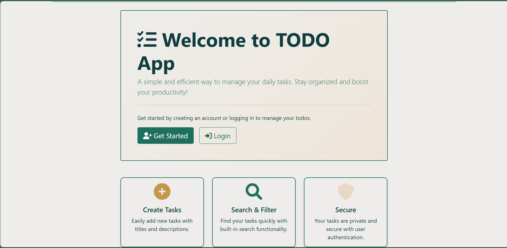
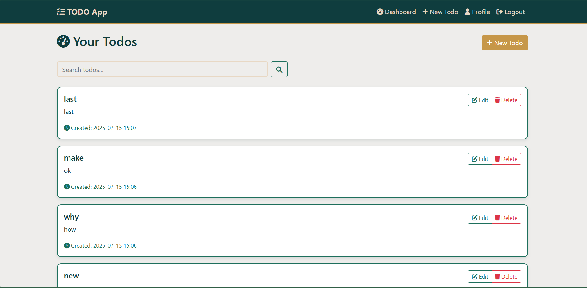

# Flask Todo App
*A full-featured Todo application with user authentication and responsive design*


## Table of Contents
- [Features](#features)
- [Tech Stack](#tech-stack)
- [Screenshots](#screenshots)
- [Architecture Overview](#architecture-overview)
- [Project Structure](#project-structure)
- [Getting Started](#getting-started)
  - [Prerequisites](#prerequisites)
  - [Installation](#installation)
  - [Configuration](#configuration)
  - [Running the App](#running-the-app)
- [Testing](#testing)
- [Contributing](#contributing)
- [License](#license)

## Features
- **User Authentication**: Secure registration and login system
- **Task Management**: Add, edit, and delete tasks
- **Task Status**: Mark tasks as complete/incomplete
- **Search & Pagination**: Find and navigate through tasks easily
- **User Profiles**: Manage user account settings
- **Responsive Design**: Mobile-friendly UI using Bootstrap
- **Persistent Storage**: Data stored in SQLite database

## Tech Stack
- **Backend**: Python 3.8+, Flask, Jinja2
- **Database**: SQLite (via SQLAlchemy)
- **Frontend**: HTML5, Bootstrap 5, Custom CSS
- **Authentication**: Flask-Login (session-based)
- **Testing**: Python unittest framework

## Screenshots

### Main Dashboard


### TODO List Management


## Architecture Overview
The project follows a modular **Model-View-Controller (MVC)** design pattern:

- **Controllers**: Handle HTTP requests, routing, and business logic (located in `app/controllers/`)
- **Models**: Manage database operations and data validation using SQLAlchemy ORM (`app/models/`)
- **Templates**: Jinja2 templates for rendering dynamic HTML pages (`app/templates/`)
- **Static Assets**: CSS, JavaScript, and images for frontend styling (`app/static/`)
- **Blueprints**: Modular components for authentication, todo management, and user profiles

## Project Structure
```
todo-app/
├── app/
│   ├── controllers/           # Route handlers and business logic
│   │   ├── create.py
│   │   ├── dashboard.py
│   │   ├── delete.py
│   │   ├── edit.py
│   │   ├── index.py
│   │   ├── login.py
│   │   ├── logout.py
│   │   ├── profile.py
│   │   ├── register.py
│   │   └── __init__.py
│   ├── models/                # Database models and schemas
│   │   ├── todo.py           # Todo item model
│   │   ├── user.py           # User authentication model
│   │   └── __init__.py
│   ├── static/               # Frontend assets
│   │   ├── css/
│   │   │   └── custom.css    # Custom styling
│   │   └── img/
│   │       ├── main.png
│   │       └── todo.png
│   ├── templates/            # Jinja2 HTML templates
│   │   ├── auth/             # Authentication pages
│   │   │   ├── login.html
│   │   │   └── register.html
│   │   ├── layout/           # Reusable components
│   │   │   ├── flash_msgs.html
│   │   │   └── navbar.html
│   │   ├── todo/             # Todo management pages
│   │   │   ├── create.html
│   │   │   ├── dashboard.html
│   │   │   ├── edit.html
│   │   │   ├── list.html
│   │   │   ├── pagination.html
│   │   │   └── search.html
│   │   ├── user/             # User profile pages
│   │   │   ├── delete.html
│   │   │   └── profile.html
│   │   ├── base.html         # Base template
│   │   └── index.html        # Homepage
│   ├── extensions.py         # Flask extensions configuration
│   ├── utils.py             # Utility functions
│   └── __init__.py          # App factory pattern
├── instance/                # Instance-specific files
│   └── todo.db              # SQLite database
├── tests/                   # Test suites
│   ├── test_auth.py         # Authentication tests
│   ├── test_conf.py         # Configuration tests
│   └── test_models.py       # Model tests
├── run.py                   # Application entry point
├── requirements.txt         # Python dependencies
├── .env.example            # Environment variables template
└── README.md               # Project documentation
```

## Getting Started

### Prerequisites
- **Python 3.8+** installed on your system
- **Git** for version control
- **Virtual environment** tool (recommended)

### Installation

1. **Clone the repository:**
   ```bash
   git clone https://github.com/AbdullAharifx/flask-todo-app.git
   cd flask-todo-app
   ```

2. **Create and activate a virtual environment:**
   ```bash
   # Create virtual environment
   python -m venv venv
   
   # Activate it
   # On Linux/macOS:
   source venv/bin/activate
   # On Windows:
   venv\Scripts\activate
   ```

3. **Install dependencies:**
   ```bash
   pip install -r requirements.txt
   ```

### Configuration

Create a `.env` file in the root directory with the following configuration:

```env
FLASK_ENV=development
SECRET_KEY=your_secret_key_here
DATABASE_URI=sqlite:///instance/todo.db
FLASK_APP=run.py
```

**Note**: Replace `your_secret_key_here` with a secure random string. You can generate one using:
```python
import secrets
print(secrets.token_hex(16))
```

### Running the App

Use the `run.py` file for proper app initialization:

```bash
python run.py
```

The application will be available at: **http://127.0.0.1:5000**

For development with auto-reload:
```bash
export FLASK_ENV=development  # On Windows: set FLASK_ENV=development
python run.py
```

## Testing

Run the test suite to ensure everything works correctly:

```bash
# Run all tests
python -m pytest tests/

# Run specific test file
python -m pytest tests/test_auth.py

# Run with coverage report
python -m pytest tests/ --cov=app
```

### Test Coverage
The test suite covers:
- **Authentication**: User registration, login, logout
- **Models**: Database operations and validations
- **Configuration**: App settings and environment variables

## Contributing

We welcome contributions! Please follow these steps:

1. **Fork the repository**
2. **Create a feature branch**: `git checkout -b feature/amazing-feature`
3. **Make your changes** and add tests if applicable
4. **Run tests**: `python -m pytest tests/`
5. **Commit your changes**: `git commit -m 'Add amazing feature'`
6. **Push to the branch**: `git push origin feature/amazing-feature`
7. **Open a Pull Request**

### Development Guidelines
- Follow PEP 8 style guidelines
- Add tests for new features
- Update documentation as needed
- Ensure all tests pass before submitting

## License

This project is licensed under the **MIT License**. See the [LICENSE](LICENSE) file for details.

---

**Built with ❤️ using Flask and Python**